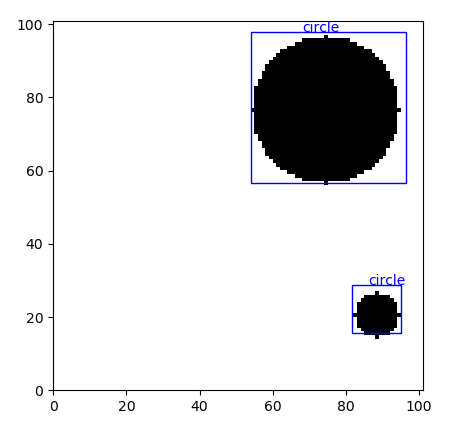
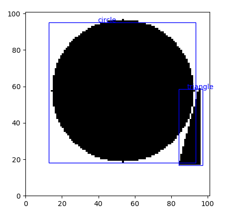

# ObjectDetector
This detector will find elementary shapes (currently implemented box, circle and triangle) on a background, by predicting the class and a bounding box.
The goal of the project was to combine classical computer vision techniques with neural networks to detect multiple
objects in a scene. A convolutional model trained on 100k images on ~70 epochs averages a 0.69 Intersection Over Union. 

### Motivation
It is a basic precursor to the more advanced techniques I am using for plaque recognition for Alzheimer's disease.
From that viewpoint it is important that this machine detects with good accuracy the different objects when sparsely located around
the scene (overlapping plaques are dealt with differently).

Below we see some results of the convolutional model on images with two objects

 
 

# Usage
Datasets are created using the ShapeCreator class as
```
s = ShapeCreator(background_size=10, num_objects=1)
s.dataset_creator(100, object_type=1)
```
The above example creates a dataset of 100 images, each with a circle. If object_type is set to None, all images will get
a random shape. Currently, 3 shapes are implemented (box, circle, triangle), but more can be added by creating a corresponding drawing function in ShapeCreator and adjusting the num_possible_shapes in Defines.py.
Two neural networks are implemented, a fully connected feed forward model (FFM) and a convolutional model (CNN). The convolutional model can be called by
```
n = CNN(input_size=input_size)
n.initialize_model()
n.train_model(train_x, train_y, val_x, val_y, batch_size=512, epochs=150, model_name='CNN_Model.h5')
```
The models can be tested, saved, loaded and used to predict on images with single or multiple objects using the NeuralNetwork class. If we predict on multiple objects, the image will first be processed in SegmentationCV using Scikit-image to extract the different separated objects. Afterwards, the segmented images are processed by the neural network.


Inside the Utils file there are two main functioins
```
Utils.draw_predictions(test_images, predicted_labels, true_labels=true_labels)
Utils.intersection_over_union(true_labels, predicted_labels)
```
The draw_predictions draws the image with objects along with the predicted label + bounding box, and, if inputted, the true label + bounding box.
The intersection over union works both on single inputs and lists of bounding boxes, in the case of a list it returns the mean IoU.
# Acknowledgements
The setup (and only the setup) of the problem is similar to
* [Object detection with neural networks](https://towardsdatascience.com/object-detection-with-neural-networks-a4e2c46b4491) 
